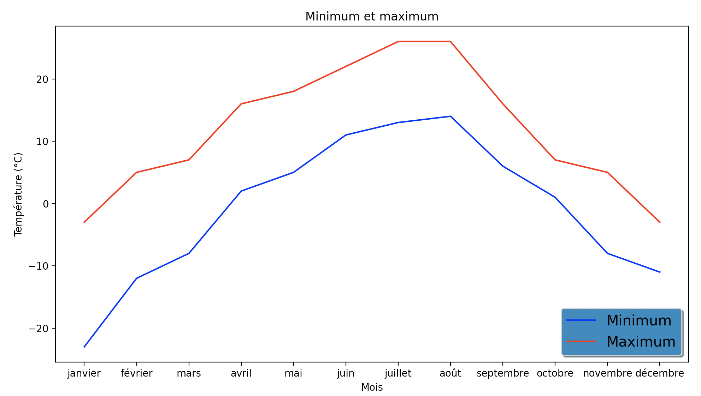
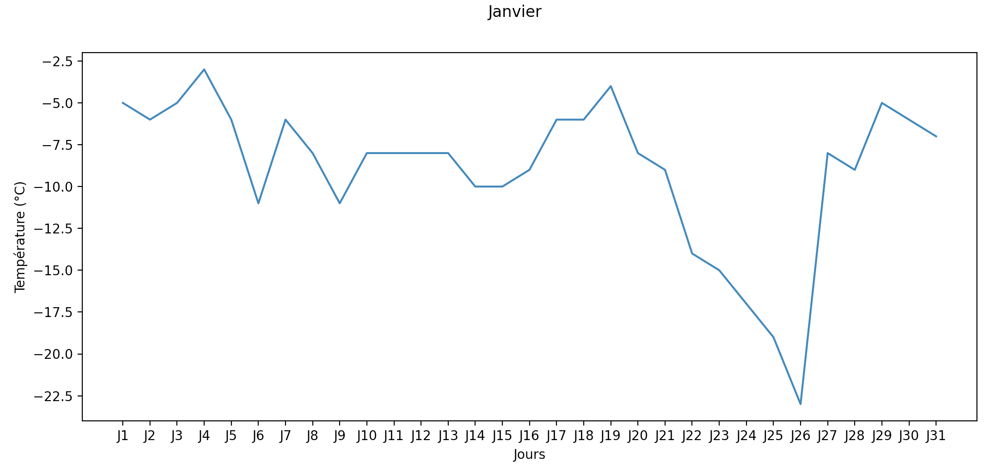
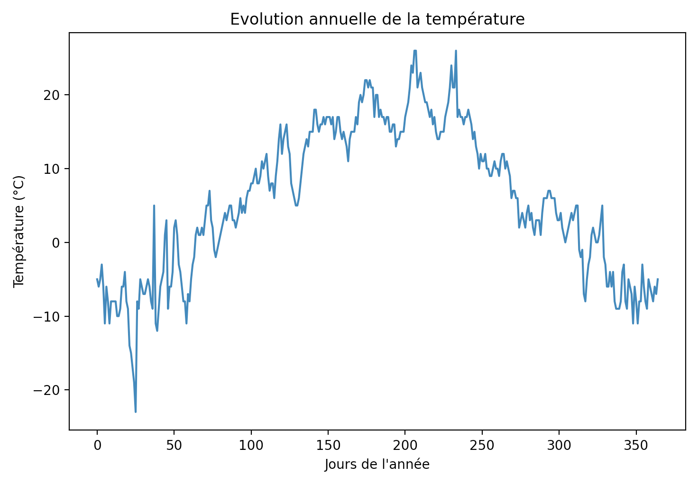
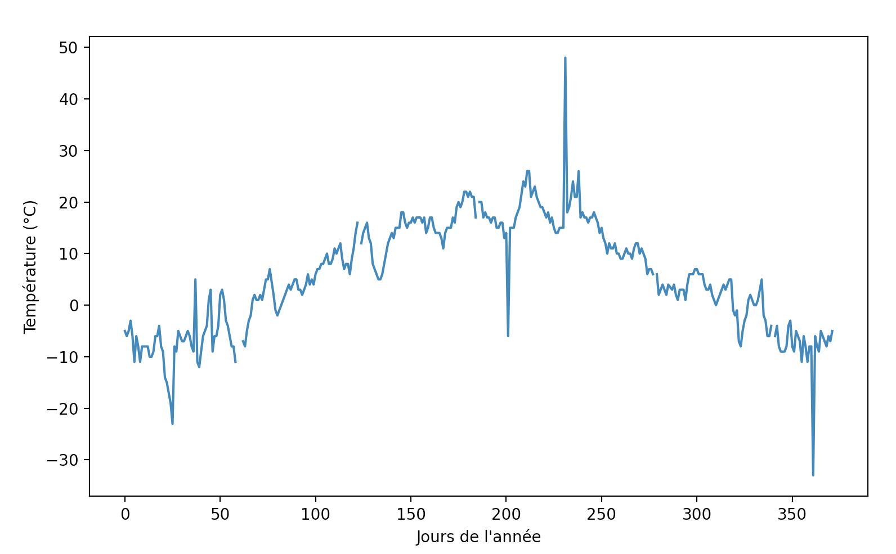
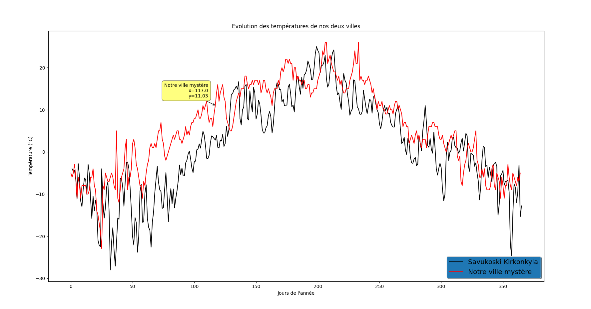

# TP1_Qualite_Donnees

Avant toute chose, veuillez penser à dézipper le csv qui se trouve dans le dossier graph puis dans le zip city_temperature.csv.zip

## Installation des librairies

* Scipy

`pip install scipy`

* matplotlib

`pip install matplotlib`

* pandas

`pip install pandas`

`pip install xlrd`

`pip install openpyxl`

## Echantillon SI

* Import de l'echantillon **SI** et création du **DataFrame** :

```python
data_climat = pd.read_excel("./graph/Climat.xlsx",sheet_name='SI ',index_col=0)
df = pd.DataFrame(data_climat)
```

* Calcul de la **moyenne par mois** :

```python
average = df.mean(axis=0,skipna = True)
```

* Calcul de **l'écart-type par mois** :

```python
st_deviation = df.std(axis=0,skipna=True)
```

* Calcul du **minimum et maximum par année** :

```python
min = df.min()
max = df.max()
```

* Traçage de la **courbe des minimums et maximums** pour chaque jours :

```python
plt.plot(min,color="blue",label='Minimum')
plt.plot(max,color="red",label='Maximum')
plt.xlabel('Mois')
plt.ylabel('Température (°C)')
plt.title("Minimum et maximum")
legend = plt.legend(loc='lower right', shadow=True, fontsize='x-large')
legend.get_frame().set_facecolor('C0')
plt.show()
```

* Aperçu de cette **courbe** :



* Traçage des **courbes de chaque mois** et de la **courbe annuelle** :

```python
month_filter = 0
liste = []
for month in range(len(df.count())):
    plt.suptitle(names[month_filter])
    plt.xlabel('Jours')
    plt.ylabel('Température (°C)')
    plt.plot(df.iloc[:, month_filter])
    mplcursors.cursor()
    plt.show()
    month_filter += 1
    for day in range(len(df.iloc[:, month_filter-1])):
        plt.xlabel('Jours de l\'année')
        plt.ylabel('Température (°C)')
        liste.append(df.iloc[day, month_filter-1])
        liste = [x for x in liste if str(x) != 'nan']
plt.title('Evolution annuelle de la température')
plt.plot(liste)
mplcursors.cursor()
plt.show()
```

* Aperçu des **courbes mensuelles et annuelles** :




## Echantillon SI-erreur

Le travail sur la feuille **SI-erreur** est le même execpté le fait que les **erreurs** de la feuille ont été corrigées

* Changements des cellules contenant les valeurs **0xFFFF** et **Sun** par la moyenne des deux valeurs du **jour précédent** et du **jour suivant** :
```python
for month in range(len(df.count())):
    for day in range(len(df.iloc[:, month])):
        if df.iloc[day, month] == "0xFFFF" or df.iloc[day, month] == "Sun":
            df.iloc[day, month] = (df.iloc[day-1, month] + df.iloc[day+1, month])/2
```

* Aperçu de la **courbe annuelle** :



***

Les **données corrigés** restent globalement proches des valeurs sans erreur, avec quelques exceptions.

# Comparaison avec Savukoski Kirkonkyla

Nous avons ensuite comparé la courbe de notre ville mystère avec celle de Savukoski Kirkonkyla.

Importation des données présente dans la feuille **Observation data** :
```python
    data_savukoski = pd.read_excel("./graph/Savukoski kirkonkyla.xlsx",sheet_name='Observation data')
```

Création des deux courbes sur l'année :
```python
    df_savukoski.plot(x ='Jours', y='Air temperature (degC)',label='Savukoski Kirkonkyla', color='black')
    plt.plot(liste,label='Notre ville mystère',color='red')
```

Différence de moyenne de température sur l'année
```python
    for i in df_savukoski:
        curr_temp = list(df_savukoski.groupby("m")['Air temperature (degC)'].mean())
        index = 0
        total_temp = 0
        for temp in curr_temp :
            total_temp += abs(average[index]-temp)
            index +=1
    print('Diff = ' + str(total_temp) + ' °C')
```


On peut voir que les courbes sont assez proche en température à certains endroits. Savukoski Kirkonkyla est une ville nordique donc on peut en déduire que notre ville mystère est une ville avec un climat de type continental.


On se rend aussi compte que la différence de moyenne de température est d'à peu près 54 degrés sur tout l'année 

## Recherche de la ville selon la température

Nous avons récupéré un jeu de données regroupant les **températures** de **chaque jour depuis 1995** pour tout un ensemble de **villes** à partir de ce [lien kaggle](https://www.kaggle.com/sudalairajkumar/daily-temperature-of-major-cities)

* Import de ce dernier échantillon :

```python
df_capitale = pd.read_csv("./graph/city_temperature.csv")
```

On estime en fonction du fichier d'exemple datant de 2018, que la date de mesure des températures a été effectuée en 2018. On filtre donc les résultats selon cette convenance

* Suppression des duplicats :
```python
df_capitale = df_capitale.drop_duplicates()
```

* On récupère les températures de 2018 seulement :
```python
df_capitale = df_capitale[df_capitale.Year == 2018]
```

* On se place en Europe en sachant que la ville que l'on recherche se situe en Europe :
```python
df_capitale = df_capitale[df_capitale.Region == 'Europe']
```

* On transforme l'unité qui est en **Farhenheit** en **degré Celsius** :
```python
df_capitale["AvgTemperature"] = (df_capitale["AvgTemperature"] - 32)/1.8
```

* On récupère la ville qui a la plus petite différence de moyenne de température par rapport à notre jeu de données de base :

```python
temp_mini = 100
ville = ""
for i in df_capitale.groupby("City") :
    df_city = pd.DataFrame(i[1])
    curr_temp = list(df_city.groupby("Month")['AvgTemperature'].mean())
    index = 0
    total_temp = 0
    for temp in curr_temp :
        total_temp += abs(average[index]-temp)
        index +=1
    if(temp_mini > total_temp) :
        temp_mini = total_temp
        ville = i[0]
print(str(ville) +' '+ str(temp_mini))
```

* On réalise les deux courbes de notre **ville** qui a la **plus petite différence** de **moyenne annuelle** par rapport à notre **ville mystère** :
```python
chosen_one = df_capitale[df_capitale.City == ville]
chosen_one['Jours'] = range(1, len(chosen_one) + 1)
chosen_one.plot(x ='Jours', y='AvgTemperature',label=ville,color='black')
plt.plot(liste,label='Notre ville mystère',color='red')
plt.xlabel('Jours de l\'année')
plt.ylabel('Température (°C)')
legend = plt.legend(loc='lower right', shadow=True, fontsize='x-large')
legend.get_frame().set_facecolor('C0')
mplcursors.cursor()
plt.show()
```

* Aperçu de **ce résultat** : Moscou


